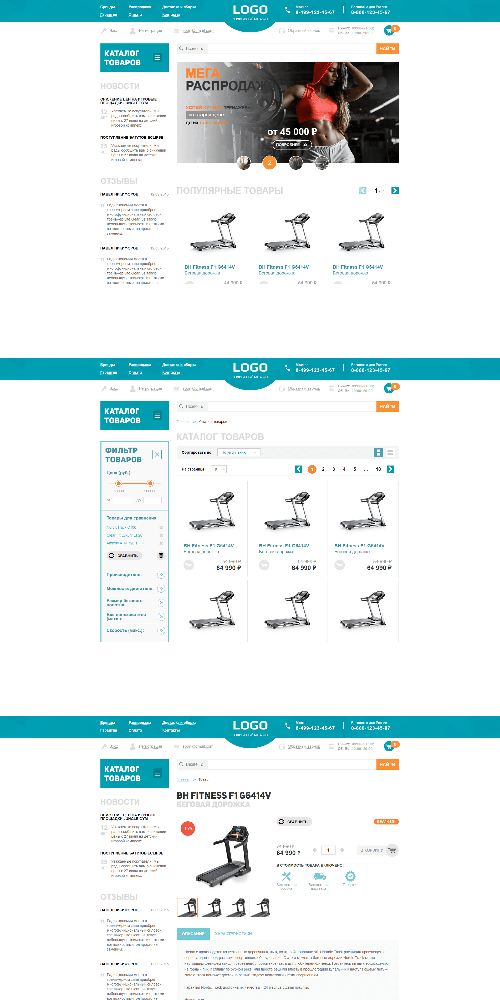

### [Logo - многостраничный сайт.](https://stalise.github.io/Logo-Shop/)
Адаптивно-отзывчивая верстка интернет-магазина до 320px. Реализована с различными вариациями слайдера. Применение JavaScript и сборка через GULP. Также реализована корзина с функцией добавления товаров. Товары добавленные в корзину сохраняются в LocalStorage.  Количество страниц - 4.

##### Стек:
* HTML
* SCSS
* JS
* GULP

##### Библиотеки и плагины:
* Swiper
* UiSlider
* SelectJs

##### Обзор:  

